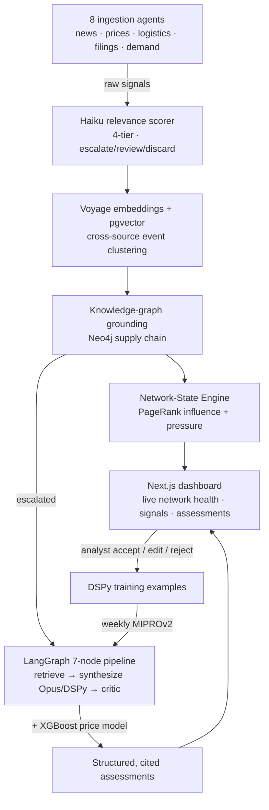

# CIS — Contract Intelligence System

> An autonomous AI analyst for a fragile, high-stakes supply chain: the giant electrical transformers that power grids and AI data centers.
> It reads the world all day, works out what matters, explains why, and gets sharper every time an expert corrects it.

**Live demo:** [web dashboard](https://ashablovskiy.github.io/CIS-PT/) · [API docs](https://cis-pt-production.up.railway.app/docs)

A personal project by **Andrei Shablovskiy** ([@ashablovskiy](https://github.com/ashablovskiy)) — built end-to-end to demonstrate applied AI engineering on real, live data (no mock data anywhere).

---

## What it does (in plain terms)

Large power transformers are the quiet bottleneck of the modern economy. They cost millions, take **2–4 years** to build, and a single late component can hold up an entire grid connection or data-center. Whoever buys them needs to see trouble coming — a copper spike, a factory fire in Korea, a new hyperscaler build-out, a tariff — often months before it shows up in a price.

CIS is a software "analyst" that does this watching automatically. Every hour it:

1. **Reads** the news, commodity markets, shipping feeds, corporate filings, and hyperscaler announcements.
2. **Judges** each item: is this actually relevant to transformer supply, and how badly? Most things are noise; it says so.
3. **Connects the dots** across a map of who makes what, where, and how it ships — so a steel-mill story becomes a specific list of exposed suppliers, plants, and shipping lanes.
4. **Notices convergence**: many small, seemingly unrelated signals piling onto the same weak point — the real early-warning that a shortage is forming.
5. **Writes it up** as a plain, cited argument ("this clause's price trigger is now met, here's the reasoning"), not just a red/amber/green dot.
6. **Learns**: when a human accepts or edits an assessment, that correction is fed back and the system automatically retrains its own reasoning.

The result is a live "network health" picture of the whole transformer supply chain, plus specific, explainable assessments an analyst can trust or challenge.

---

## The interesting part — frontier AI, and how it's used here

This project is a tour of how modern AI techniques combine into one working system. Each technique below is doing a real job, not a demo:

- **Agentic ingestion.** Eight autonomous source agents (GDELT world-news, commodity prices, ocean logistics, trade press, hyperscaler demand, SEC filings, investor relations, Chinese steel) run on a shared pipeline: pull → rule-filter → LLM-score → persist. Each degrades gracefully when a feed or API is down.

- **Tiered LLM judgment at scale.** Claude Haiku scores every incoming item into a strict 4-tier relevance taxonomy with a controlled "impact mechanism" vocabulary — cheap, fast, and calibrated to be *conservative* (most news is correctly ignored).

- **Knowledge-graph grounding.** A Neo4j graph models the real supply chain (commodity → material → plant → supplier → port → shipping lane). A signal is expanded by multi-hop Cypher traversal into its actual "blast radius" of affected entities — this is how the system reasons about second-order effects.

- **Vector RAG + semantic de-duplication.** Voyage `voyage-3-large` embeddings in pgvector power two things: retrieving historical precedents for calibration, and clustering coverage of the *same* real-world event across dozens of outlets (cosine > 0.85 within 72h) so 15 articles count as one — not 15× the alarm.

- **A "network-state" engine (graph theory meets live signals).** The supply chain is a weighted directed graph. Reverse-graph **PageRank** ranks *systemic influence* (who is most depended-upon). **Personalized PageRank**, seeded by live signal pressure, diffuses stress through the network to reveal where independent pressures **converge** — a formal model of "small unrelated events combining into a disruption." Named companies (Layer 1) roll up into 8 systemic forces (Layer 2) for a readable health index.

- **A 7-node agentic reasoning pipeline with self-critique.** Built on LangGraph: `triage → graph retrieval → similarity search → contract matching → synthesis → critic → persist`. The synthesizer (Claude Opus, via a typed **DSPy** signature) writes a structured, step-by-step assessment; a separate **critic** node then checks it for grounding, coverage, and over-confidence before anything is saved.

- **Neuro-symbolic hybrid.** An **XGBoost** commodity-price model runs alongside the LLM and injects a data-driven magnitude estimate into every price call — combining learned statistical priors with language-model reasoning.

- **Self-improving prompts (the headline).** Analyst accept/edit/reject decisions become **DSPy training examples**. A weekly **MIPROv2** optimization run recompiles the synthesizer's prompt program automatically, keeps it only if it beats the current one on a held-out set, and hot-loads the winner. The system's core reasoning literally improves from human feedback, without a human touching a prompt.

- **Production-grade LLM ops.** Versioned prompt registry with sub-5-minute hot-reload (edit prompts in the UI, no redeploy), per-model daily budget caps enforced on every call, full trace IDs, and fallback behavior at every external boundary.

---

## Architecture at a glance

---

## Tech stack

| Layer | Choice |
|---|---|
| Reasoning LLM | Claude Opus (`claude-opus-4-5`) via DSPy typed signatures |
| Bulk LLM | Claude Haiku (`claude-haiku-4-5`) — scoring, triage, critique |
| Embeddings | Voyage AI `voyage-3-large` (1024-dim) |
| Agent orchestration | LangGraph — 7-node `StateGraph` |
| Prompt optimization | DSPy + MIPROv2 (feedback-driven) |
| Classical ML | XGBoost — commodity price impact |
| Graph reasoning | Neo4j + networkx (PageRank / personalized PageRank) |
| Relational + vector | Neon Postgres + pgvector |
| Backend | Python 3.12, FastAPI, async SQLAlchemy |
| Frontend | Next.js 16, React 19, TypeScript, Tailwind v4 |
| Scheduling | Inngest cron functions |
| Observability | LangSmith tracing |

---

*Full technical teardown: [`docs/SYSTEM_BLUEPRINT.md`](docs/SYSTEM_BLUEPRINT.md).*
