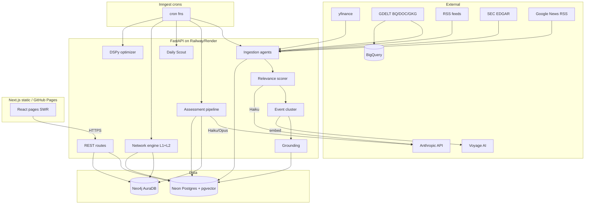
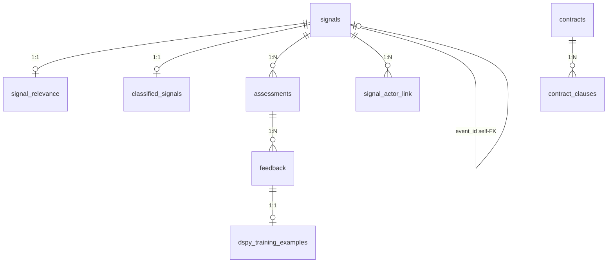
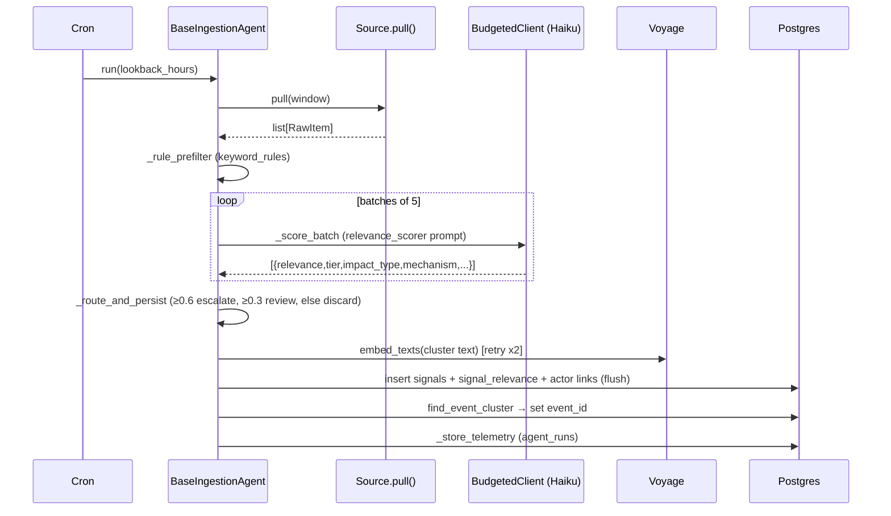
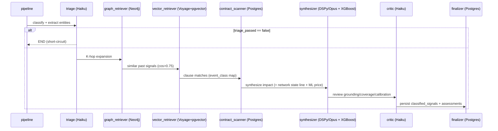
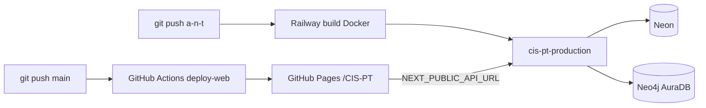

# CIS — Contract Intelligence System: Complete Technical Blueprint

> Reverse-engineered snapshot of the implementation as it exists in the repository.
> Scope: everything under the repo root excluding vendored dependencies
> (`node_modules/`, `.venv/`, `.next/`, `out/`, `__pycache__/`, `.ruff_cache/`).
>
> **Evidence convention.** Statements are derived directly from source unless tagged
> **(inferred)**, which marks a characterization of runtime behavior not stated
> literally in a single line of code. Exact files, classes, and functions are cited
> throughout.

---

## Phase 1 — Project Inventory

### 1.1 Repository root

| Path | Type | Purpose |
|------|------|---------|
| `pyproject.toml` | config | Python project + dependencies (`cis-api`), ruff/pyright/pytest config |
| `uv.lock` | lockfile | `uv` resolved dependency lock |
| `alembic.ini` | config | Alembic migration runner config |
| `Dockerfile` | infra | Multi-stage API image (Python 3.12 + uv + uvicorn) |
| `docker-compose.yml` | infra | Local Postgres (pgvector) + Neo4j |
| `railway.toml` | infra | Railway API deploy config (Docker builder, healthcheck `/health`) |
| `render.yaml` | infra | Render blueprint (cis-api Docker + cis-web Node static) |
| `pnpm-workspace.yaml`, `pnpm-lock.yaml` | config | pnpm workspace for `apps/web` |
| `__init__.py` | code | Repo root package marker (enables `apps.*` imports) |
| `.env`, `.env.example` | config | Runtime secrets / template |
| `.github/workflows/deploy-web.yml` | CI | GitHub Pages deploy of `apps/web` |
| `README.md` | docs | Project overview |

### 1.2 Backend — `apps/api/`

**Entry / config / glue**
- `main.py` — FastAPI app, CORS, Inngest registration, router includes, `/health`
- `settings.py` — `Settings` (pydantic-settings) singleton
- `budget.py` — `BudgetedClient`, `_DailySpend`, `BudgetExceededError`
- `deps.py` — `get_db`, `DbSession`, `GraphClient` DI aliases
- `agent_configs.py` — JSON-backed per-agent config (`agent_configs.json`)
- `agent_runtime.py` — in-memory "currently running" registry

**Database — `db/`**
- `models.py` — all 14 SQLAlchemy ORM models
- `session.py` — async engine + `async_session_factory`
- `migrations/` — Alembic env + 8 version scripts (`versions/`)

**Ingestion — `ingest/`**
- `base.py` — `RawItem`, `ScoredItem`, `IngestionState` (pydantic)
- `runner.py` — `BaseIngestionAgent` (full pipeline), engine builder
- `keyword_registry.py` — `KeywordRegistry` (Neo4j-backed keywords + priors)
- `sources/` — `prices_agent.py`, `gdelt_agent.py`, `logistics_agent.py`, `press_agent.py`, `demand_agent.py`, `sec_agent.py`, `ir_agent.py`, `mysteel_agent.py`, plus `press_feeds.yml`, `ir_feeds.yml`

**Assessment — `assess/`**
- `pipeline.py` — LangGraph 7-node graph + `run_assessment`, `run_assessments_for_escalated`
- `embeddings.py` — Voyage AI helper (`voyage-3-large`, 1024-dim)
- `nodes/` — `triage.py`, `graph_retriever.py`, `vector_retriever.py`, `contract_scanner.py`, `synthesizer.py`, `critic.py`, `finalizer.py`

**Agent state — `agents/`**
- `state.py` — `AssessmentState`, `ReasoningStep`

**Classification — `classify/`**
- `schemas.py` — `EventClass`, `ImpactDimension`, `ClassificationResult`, `RelevanceScore`

**Network State Engine — `network/`**
- `weights.py` — edge/node weighting tables (Phase 0)
- `topology.py` — Neo4j → networkx loader (L1)
- `influence.py` — static systemic influence (reverse PageRank)
- `pressure.py` — dynamic direct + propagated pressure (L1)
- `state.py` — `compute_network_state`, `propagation_paths` (L1 product layer)
- `grounding.py` — signal → actor links (`signal_actor_link`)
- `event_cluster.py` — cross-source dedup (`find_event_cluster`)
- `actor_map.py` — L2 ANT 8-actor canonical definition
- `rollup.py` — L1 entity / impact_type → L2 actor mapping
- `ant_state.py` — `compute_ant_state` (L2)
- `snapshot.py` — `take_snapshot` (persists `network_snapshot`)

**Graph — `graph/`**
- `client.py` — Neo4j async driver wrapper (`Neo4jClient`)
- `queries.py` — named Cypher query strings

**Prompts — `prompts/`**
- `registry.py` — `PromptRegistry` (DB-backed, cached) + hardcoded `DEFAULTS`

**ML — `ml/`**
- `price_impact.py` — `PriceImpactEstimator` (XGBoost + rule fallback)
- `models/` — `price_magnitude_xgb.pkl`, `price_direction_xgb.pkl`, `price_feature_names.json`

**DSPy — `dspy_lab/`**
- `optimizer.py` — MIPROv2 pipeline (`run_optimization`, `load_compiled_program`)
- `metrics.py` — `assessment_quality_metric`
- `training_data.py` — `BOOTSTRAP_EXAMPLES`, `get_trainset`

**Scout — `scout/`**
- `daily_scout.py` — `run_daily_scout` (daily brief generation)

**Scheduling — `inngest_functions/`**
- `agent_crons.py` — all Inngest cron functions + `ALL_FUNCTIONS`

**Routes — `routes/`**
- `signals.py`, `ingest.py`, `assessments.py`, `briefs.py`, `agents.py`, `feedback.py`, `prompts.py`, `network.py`

**Secrets — `secrets/`** — `gcp.json` (GCP service account), `.gitkeep`

### 1.3 Frontend — `apps/web/`

- `app/layout.tsx` — root layout (Sidebar + main)
- `app/Sidebar.tsx` — collapsible nav
- `app/globals.css` — Tailwind v4 import + theme tokens
- `app/page.tsx` — Daily Brief landing (`/`)
- `app/signals/page.tsx` — Signals intelligence table (`/signals`)
- `app/network/page.tsx` — Network State (`/network`)
- `app/assessments/page.tsx` + `app/assessments/detail/page.tsx`
- `app/agents/page.tsx` — Agent control panel (`/agents`)
- `app/admin/prompts/page.tsx` — Prompt admin (`/admin/prompts`)
- `next.config.ts`, `package.json`, `tsconfig.json`, `postcss.config.mjs`, `eslint.config.mjs`, `.env.local`

### 1.4 Scripts — `scripts/`

`run_agents.py`, `run_assessment.py`, `run_triage.py`, `run_scout.py`, `run_optimizer.py`,
`recluster_events.py`, `rescore_signals.py`, `rescore_gdelt.py`, `triage_backfill.py`,
`backfill.py`, `backfill_15d.py`, `backfill_actor_links.py`, `backtest_30d.py`,
`collect_gdelt_30d.py`, `persist_gdelt_jsonl.py`, `clear_signals.py`,
`generate_contracts.py`, `train_price_model.py`, `seed_db.py`, `seed_graph.py`,
`seed_prompts.py`, and `seed_data/` (`transformers_graph.py`, `contracts.json`,
`category_strategy.json`).

### 1.5 Tests / Eval / Docs

- `tests/unit/` — `test_feedback_training.py`, `test_metrics.py`, `test_price_impact.py`, `test_prompt_registry.py`; `tests/conftest.py`
- `eval/` — `golden.jsonl`, `run_eval.py`, `runs/`
- `docs/` — `architecture.md`, `domain.md`, `data_sources.md`, `xgboost_implementation.md`, `decisions/` (ADRs), three `diagram-*.html`

---

## Phase 2 — System Overview

CIS is a supply-chain intelligence system specialized for **power transformer
procurement**. It ingests external market/news/filing signals, scores and
classifies them, grounds them onto a domain knowledge graph, computes a
two-layer "network state," produces structured impact assessments, and serves
everything through a REST API consumed by a static Next.js frontend.

### 2.1 Major subsystems

1. **Ingestion** (`apps/api/ingest`) — 8 source agents on a common base pipeline.
2. **Relevance scoring** (`runner._score_batch` + `prompts.relevance_scorer`) — Haiku batch tiering.
3. **Event clustering** (`network/event_cluster`) — Voyage embeddings + pgvector cosine dedup.
4. **Network grounding** (`network/grounding`) — signal → graph-actor pressure links.
5. **Network State Engine** — L1 Neo4j/networkx graph + L2 ANT 8-actor rollup.
6. **Assessment pipeline** (`assess/`) — 7-node LangGraph: triage → retrieval → synthesis → critique → persist.
7. **ML price layer** (`ml/price_impact`) — XGBoost magnitude/direction enrichment.
8. **DSPy optimization** (`dspy_lab/`) — MIPROv2 self-improvement of the synthesizer.
9. **Daily Scout** (`scout/`) — Opus daily brief.
10. **Scheduling** (`inngest_functions/`) — Inngest crons.
11. **Prompt registry** (`prompts/`) — versioned DB-backed system prompts.
12. **API** (`routes/`) + **Frontend** (`apps/web`).

### 2.2 Runtime architecture



### 2.3 Execution boundaries

- **API process** (`uvicorn apps.api.main:app`, 2 workers per Dockerfile) — serves REST + Inngest webhook + runs background agent tasks.
- **Inngest** — external scheduler that calls back into the API's `/api/inngest` endpoint to trigger cron functions (registered only when `INNGEST_SIGNING_KEY` is set and not the placeholder).
- **Frontend** — fully static (`output: "export"`), all pages `"use client"`, talks to the API directly over HTTPS via `NEXT_PUBLIC_API_URL`.
- **Databases** — Neon Postgres (relational + pgvector), Neo4j AuraDB (graph). Both external managed services in production; dockerized locally.

### 2.4 Internal communication

- Backend↔Postgres: SQLAlchemy async (`asyncpg`) via `async_session_factory`; some scripts use sync `psycopg2`.
- Backend↔Neo4j: `neo4j` async driver (`graph/client.py`) for pipeline; sync driver in `keyword_registry.py`.
- Backend↔LLMs: `anthropic.AsyncAnthropic` (wrapped by `BudgetedClient`) and DSPy `dspy.LM` (LiteLLM → Anthropic).
- Backend↔Voyage: `voyageai.AsyncClient`.
- Frontend↔Backend: `fetch`/SWR against `/api/*`.

---

## Phase 3 — Repository Structure

### 3.1 Directory purposes

| Directory | Purpose |
|-----------|---------|
| `apps/api/` | FastAPI backend (Python package, importable as `apps.api`) |
| `apps/web/` | Next.js 16 frontend (pnpm workspace) |
| `scripts/` | Operational + seed + backfill CLI scripts |
| `scripts/seed_data/` | Static domain data (graph + contracts JSON) |
| `eval/` | Golden-set evaluation harness |
| `tests/` | pytest unit/integration tests |
| `docs/` | Architecture/domain docs, ADRs, HTML diagrams |
| `packages/shared/` | Reserved workspace package (only `.gitkeep`) |
| `apps/api/secrets/` | GCP service-account JSON |
| `apps/api/ml/models/` | Serialized XGBoost models + feature names |

### 3.2 Entry points

- **API:** `apps/api/main.py` → module-level `app` (FastAPI). Dev: `python -m apps.api.main` runs uvicorn on `:8000` with reload (`__main__` block). Container: `uvicorn apps.api.main:app --host 0.0.0.0 --port ${PORT:-8000} --workers 2`.
- **Frontend:** `next dev` / `next build` (static export to `apps/web/out/`).
- **Migrations:** Alembic (`alembic.ini` → `apps/api/db/migrations/env.py`).
- **Scripts:** each `scripts/*.py` is a standalone `uv run python scripts/<name>.py`.

### 3.3 Startup sequence (API) (inferred from import side effects)

1. `main.py` imports `agent_crons` → constructs `inngest_client` and all cron functions.
2. `logging.basicConfig(level=settings.log_level)`.
3. `FastAPI(...)` app created; CORS middleware added from `settings.web_base_url` + `settings.cors_origins` + localhost.
4. Inngest served at `/api/inngest` only if signing key present and ≠ `"signkey-FILL_ME_IN"`.
5. Routers included under `/api/*`.
6. Module-level singletons initialize lazily on first use: `budgeted_client` (eager), `prompts.registry` (lazy DB load), `keyword_registry.registry` (lazy Neo4j load), `price_impact_estimator` (eager model load at import), `assess.pipeline._graph` (compiled at import), `synthesizer._predictor` (loads compiled DSPy program at import).

### 3.4 Build sequence

- **API image** (`Dockerfile`): Stage 1 `uv sync --frozen --no-dev --no-install-project` into `/app/.venv`; Stage 2 copies venv + `apps/`, `scripts/`, `__init__.py`; sets `PYTHONPATH=/app`; CMD uvicorn.
- **Frontend** (`.github/workflows/deploy-web.yml`): `pnpm install --frozen-lockfile` → `pnpm build` with `NEXT_PUBLIC_API_URL=https://cis-pt-production.up.railway.app` → `touch out/.nojekyll` → upload `apps/web/out` → GitHub Pages deploy.

---

## Phase 4 — Technology Stack

### 4.1 Languages
- **Python ≥ 3.12** (backend; `requires-python = ">=3.12"`).
- **TypeScript 5 / React 19** (frontend).
- **Cypher** (Neo4j queries), **SQL** (raw pgvector queries).

### 4.2 Backend dependencies (`pyproject.toml`) and usage

| Dependency | Where | What it provides |
|-----------|-------|------------------|
| `fastapi`, `uvicorn[standard]` | `main.py`, `routes/` | HTTP API server |
| `pydantic`, `pydantic-settings` | `settings.py`, `agents/state.py`, `ingest/base.py`, schemas | Validation + typed state |
| `sqlalchemy[asyncio]`, `asyncpg`, `psycopg2-binary` | `db/`, all routes, scripts | ORM + async/sync Postgres drivers |
| `alembic` | `db/migrations/` | Schema migrations |
| `pgvector` | `db/models.py` (`Vector(1024)`), retrieval SQL | Vector columns + cosine search |
| `neo4j` | `graph/client.py`, `keyword_registry.py`, `network/topology.py`, `seed_graph.py` | Graph DB driver |
| `anthropic` | `budget.py`, `scout/daily_scout.py`, `routes/ingest.py` | Claude Haiku/Opus calls |
| `voyageai` | `assess/embeddings.py` | `voyage-3-large` embeddings (1024-dim) |
| `langgraph` | `assess/pipeline.py` | 7-node `StateGraph` orchestration |
| `langchain-anthropic`, `langsmith` | (deps; tracing config in settings) | LLM tooling / tracing |
| `dspy` | `assess/nodes/synthesizer.py`, `dspy_lab/` | Typed signature + MIPROv2 optimization |
| `inngest` | `inngest_functions/agent_crons.py`, `main.py` | Cron scheduling |
| `yfinance` | `prices_agent.py`, `logistics_agent.py`, `train_price_model.py` | Commodity/ETF price history |
| `feedparser` | press/demand/ir/logistics agents | RSS parsing |
| `httpx` | many agents, `routes/ingest.py` | Async HTTP |
| `tenacity` | runner + most agents | Retry with exponential backoff |
| `google-cloud-bigquery` | `gdelt_agent.py` | GDELT GKG queries |
| `xgboost`, `scikit-learn`, `pandas`, `numpy` | `ml/price_impact.py`, `train_price_model.py` | Price impact ML |
| `networkx` | `network/` | PageRank influence + pressure propagation |
| `pypdf`, `python-docx`, `python-multipart`, `beautifulsoup4` | `routes/ingest.py` | Manual URL/file ingestion parsing |

Dev: `ruff` (lint, line-length 100, rules `E,F,I,UP,B,SIM,TCH`), `pyright` (strict, `apps/api`), `pytest` + `pytest-asyncio` (`asyncio_mode=auto`), `pytest-httpx`.

### 4.3 Frontend dependencies (`apps/web/package.json`)

| Dependency | Usage |
|-----------|-------|
| `next` 16.2.6 | App Router, static export |
| `react` / `react-dom` 19.2.4 | UI |
| `swr` ^2.4.1 | Data fetching + polling (`refreshInterval`) |
| `date-fns` ^4.3.0 | `formatDistanceToNow` |
| `tailwindcss` ^4 + `@tailwindcss/postcss` | Styling |
| `eslint` / `eslint-config-next` | Lint |

### 4.4 Infrastructure / third-party services

- **Neon** — serverless Postgres (NullPool engine, SSL-aware; `runner._make_asyncpg_engine`).
- **Neo4j AuraDB** — managed graph.
- **Anthropic** — `claude-haiku-4-5-20251001`, `claude-opus-4-5-20251101` (and `claude-opus-4-7` priced in `budget._PRICING`).
- **Voyage AI** — `voyage-3-large`.
- **Google BigQuery** — `gdelt-bq.gdeltv2.gkg_partitioned` (project `cis-gdelt`, 5 GB billed cap).
- **Inngest** — cron triggers.
- **LangSmith** — optional tracing (`langchain_tracing_v2`).
- **Railway** (`railway.toml`) and **Render** (`render.yaml`) — API hosting options; **GitHub Pages** — frontend.

---

## Phase 5 — Domain Model

### 5.1 Relational entities (`apps/api/db/models.py`)

`Base = DeclarativeBase`. UUID PKs via `_uuid()` default. Timestamps `server_default=func.now()`.



**`Signal`** (`signals`) — `id`, `source`, `source_id` (UNIQUE with source: `uq_signal_source_id`), `raw_payload` JSONB, `url`, `ingested_at`, `occurred_at`, `content_hash`, `embedding` `Vector(1024)`, `event_id` self-FK (`fk_signal_event_id`, `ondelete=SET NULL`, indexed). Relationships: `relevance`, `classified`, `assessments`.

**`SignalRelevance`** (`signal_relevance`, PK=`signal_id`) — `rule_score`, `llm_score`, `analyst_score`, `impact_type`, `impact_tier` (1–4), `decision` (`discard|review|escalate`), `reasoning`, `scored_at`, `mechanism`, `signal_kind`, `what_changed`.

**`ClassifiedSignal`** (`classified_signals`, UNIQUE `signal_id`) — `event_class`, `geo_tags` text[], `graph_entities` JSONB, `commodities` text[], `impact_dimensions` text[], `confidence`, `classifier_version`, `embedding` `Vector(1024)`, `triage_reasoning`, `secondary_event_classes` text[], `state_change` JSONB.

**`Contract`** (`contracts`) — `external_id` UNIQUE, `supplier_name`, `category`, `start_date`, `end_date`, `total_value_usd` Numeric, `full_text`, `metadata_` (column `metadata`). Children `clauses`.

**`ContractClause`** (`contract_clauses`) — `contract_id` FK, `clause_type` (`force_majeure|indexation|escalation|ld|slot|incoterms|delivery_obligation|heavy_lift`), `text`, `references_commodities` text[], `parsed_params` JSONB, `embedding` `Vector(1024)`.

**`Assessment`** (`assessments`) — `signal_id` FK, `agent_version`, `dspy_program_version`, `summary`, `affected_entities` JSONB, `affected_clauses` JSONB, `impact` JSONB, `reasoning_chain` JSONB, `confidence`, `status` (`pending|complete|needs_review|error`), `raw_trace_id`. Children `feedback`.

**`DailyBrief`** (`daily_briefs`) — `brief_date` UNIQUE, `signal_count`, `themes` JSONB, `body_markdown`, `flagged_for_assessment` text[], `created_at`, `raw_trace_id`.

**`Feedback`** (`feedback`) — `assessment_id` FK, `user_action` (`accept|edit|reject`), `original_payload` JSONB, `corrected_payload` JSONB, `rationale`. Child `training_example`.

**`DspyTrainingExample`** (`dspy_training_examples`) — `feedback_id` FK, `inputs` JSONB, `expected_outputs` JSONB, `weight` (default 1.0).

**`DspyProgram`** (`dspy_programs`) — `version` UNIQUE, `serialized_program` JSONB, `compile_metrics` JSONB, `is_active` bool.

**`PromptTemplate`** (`prompt_templates`, UNIQUE `name,version`) — `name` (indexed), `version` int, `system_text`, `description`, `model_hint`, `is_active`, `metrics` JSONB, `created_by`, `created_at`.

**`SignalActorLink`** (`signal_actor_link`, UNIQUE `signal_id,actor_name`) — `signal_id` FK (CASCADE), `actor_name` (indexed), `actor_label`, `match_kind` (`direct|expanded`), `pressure` float.

**`NetworkSnapshot`** (`network_snapshot`) — `computed_at` (indexed), `health_index`, `health_label` (`resilient|constrained|fragile`), `top_actors_json`, `hotspots_json`, `bottlenecks_json`, `signal_window_hours`, `signal_count`, `ant_state_json`.

**`AgentRun`** (`agent_runs`) — `agent_name`, `started_at`, `finished_at`, `status` (`ok|error|budget_exceeded`), `items_pulled`, `items_passed_rules`, `items_passed_llm`, `items_classified`, `tokens_used`, `cost_usd`, `notes`, `trace_id`.

### 5.2 Graph domain (Neo4j) — `scripts/seed_data/transformers_graph.py`

**Node labels** (loaded in order by `seed_graph.NODE_GROUPS`, PK = `name`, unique constraint per label): `Commodity`, `Material`, `Country`, `Supplier`, `Plant`, `Port`, `Lane`, `Category`, `DemandSource`. Node properties include `name`, `aliases`, `criticality`, `impact_weight` (used by `keyword_registry` priors and `network` weighting).

**Relationship types** (`EDGES`): `USES_MATERIAL`, `IS_FORM_OF`, `OPERATED_BY`, `PRODUCES`, `SHIPS_VIA`, `ON_LANE`, `LOCATED_IN`, `SUB_TIER_OF`, `ALTERNATIVE_TO`, `CONSTRAINS`, `DEMAND_PULLS_ON`, `DRIVES_DEMAND_FOR`, `BELONGS_TO_THEME`.

### 5.3 Two-layer actor model

- **Layer 1 (L1)** = the Neo4j graph above, loaded into a weighted `networkx.DiGraph` (`network/topology.py`).
- **Layer 2 (L2 / ANT)** = 8 systemic actors defined statically in `network/actor_map.py`: `Critical_Components`, `OEM_Production_Capacity`, `Heavy_Lift_Logistics`, `Trade_Policy_Regime`, `Geographic_Concentration`, `AI_Datacenter_Demand`, `Grid_Modernization_Demand`, `Energy_Transition_Policy`. Bands: `components, production, logistics, trade_geo, demand`. 12 `ACTOR_EDGES` (`CONSTRAINS`, `GATES`, `PRESSURES`, `AMPLIFIES`). L1→L2 mapping in `network/rollup.py` (`ENTITY_TO_L2`, `IMPACT_TYPE_TO_L2`).

### 5.4 Controlled vocabularies (`classify/schemas.py` + prompts)

- `EventClass`: `commodity_price_move, geopolitical_disruption, supplier_capacity, logistics_disruption, regulatory_trade, demand_surge, financial_disclosure, natural_disaster, other`.
- `ImpactDimension`: `price, availability, lead_time, logistics, regulatory, demand`.
- `impact_type` (scorer): `GOES input cost, Winding metal cost, Insulation material, OEM capacity, OEM disruption, Sub-tier supplier, Lane disruption, Demand surge, Regulatory / trade, Macro proxy, No TP impact`.
- `signal_kind`: `price_move, capacity_change, logistics_disruption, regulatory_action, demand_shift, geopolitical, financial_disclosure, weather_climate, other`.

---

## Phase 6 — Data Architecture

### 6.1 Schema & migrations

Schema authored in `db/models.py`; DDL evolution in Alembic (`db/migrations/versions/`). Linear revision chain:

```
f4c2b9891464 (initial_schema)
  → 8c9bc429e119 (alter embedding columns to vector)
  → 5d22c99a5782 (add prompt_templates table)
  → 62150047f085 (signal_relevance analyst_score + tier)
  → a1b2c3d4e5f6 (network_state_intelligence)
  → b2c3d4e5f6a1 (add ant_state to network_snapshot)
  → c3d4e5f6a1b2 (add event_clustering)
  → d4e5f6a1b2c3 (signal_table_enrichment)
```

`alembic.ini` + `migrations/env.py` run migrations against `DATABASE_SYNC_URL` (psycopg2). pgvector columns: `signals.embedding`, `classified_signals.embedding`, `contract_clauses.embedding`, all `Vector(1024)`.

### 6.2 Persistence mechanisms

- **Async path:** `db/session.py` builds the engine via `runner._make_asyncpg_engine` (strips `sslmode`, passes `ssl=True`, `poolclass=NullPool`, `connect_args.timeout=60`). `async_session_factory` = `async_sessionmaker(expire_on_commit=False)`.
- **Sync path:** scripts (`rescore_signals.py`, `rescore_gdelt.py`) use `psycopg2.connect` against `DATABASE_SYNC_URL`.
- **Ingestion engine:** `BaseIngestionAgent.__init__` builds its own engine + `async_sessionmaker` per agent instance.

### 6.3 Write paths

- **Ingestion** → `signals`, `signal_relevance`, `signal_actor_link` (`runner._persist_signals`), then `signals.event_id` (Pass 2 clustering).
- **Assessment** → `classified_signals` + `assessments` (`finalizer_node`).
- **Triage script** → `classified_signals` only (`run_triage.py`).
- **Scout** → `daily_briefs` (`_upsert_brief`).
- **Feedback** → `feedback` + `dspy_training_examples` (`routes/feedback.submit_feedback`).
- **Optimizer** → `dspy_programs` (`dspy_lab/optimizer._persist_to_db`).
- **Snapshots** → `network_snapshot` (`network/snapshot.take_snapshot`).
- **Telemetry** → `agent_runs` (`runner._store_telemetry`).
- **Prompt admin** → `prompt_templates` (`routes/prompts`).

### 6.4 Read paths

- **Vector retrieval** (`vector_retriever`): inline vector literal `'[...]'::vector`, `1 - (embedding <=> q)` cosine, `> 0.75`, top-5.
- **Event clustering** (`event_cluster.find_event_cluster`): cosine `> 0.85` within `occurred_at - 72h`, `source_id != excl_source_id`, `id != signal_id`, ordered by `<=>`.
- **Network pressure** (`pressure.direct_pressure`, `ant_state._l2_direct_pressure`): join `signal_actor_link`/`signal_relevance` → `signals` filtered by `occurred_at`.
- **Signals feed** (`routes/signals.list_signals`): `signals ⟕ signal_relevance ⟕ classified_signals`, window by `ingested_at`.

### 6.5 Transformation paths

Raw payload → (scorer) relevance fields → (clustering) `event_id` → (grounding) `signal_actor_link.pressure` → (network) influence×pressure aggregates → (assessment) `classified_signals` + `assessments` → (feedback) `dspy_training_examples` → (optimizer) `dspy_programs` → (synthesizer) loaded compiled program.

---

## Phase 7 — Workflow Documentation

### 7.1 Ingestion workflow

**Entry:** `BaseIngestionAgent.run(lookback_hours)` (`ingest/runner.py`).
**Trigger:** Inngest cron, `POST /api/agents/run/{source}`, or `scripts/run_agents.py`.
**Inputs:** lookback window. **Outputs:** persisted `signals` + `signal_relevance` + `signal_actor_link`; `agent_runs` telemetry.



Decision branches: rule filter (keyword hit), batch scoring failure → rule-based fallback (`llm_score=0.4`, reasoning `llm_unavailable_rule_fallback`), JSON truncation recovery, embedding failure → `event_id` left null (re-clustered later), routing thresholds (`_ESCALATE_THRESHOLD=0.6`, `_REVIEW_THRESHOLD=0.3`).

### 7.2 Assessment workflow (`assess/pipeline.py`)

**Entry:** `run_assessment(signal_id, payload)`; batch `run_assessments_for_escalated(lookback_hours)`.
**Trigger:** Inngest `assessment_fn` (hourly :45), `scripts/run_assessment.py`.



Status logic (`finalizer_node`): `error` if errors and no summary; `needs_review` if `critic_passed=False`; else `complete`.

### 7.3 Daily Scout workflow (`scout/daily_scout.py`)

Fetch escalated signals last 24h (limit 60) → group by `event_class` (fallback source) → flag `llm_score ≥ 0.75` → prepend network-state block (`compute_network_state`) → Opus (`daily_brief` prompt) → upsert `daily_briefs`.

### 7.4 Network snapshot workflow (`network/snapshot.take_snapshot`)

`compute_network_state` (L1) + `compute_ant_state` (L2) + distinct signal count → insert `network_snapshot` row (the state-estimation time series).

### 7.5 DSPy optimization workflow (`dspy_lab/optimizer.run_optimization`)

`get_trainset` → 80/20 split → baseline dev score → MIPROv2 compile (`assessment_quality_metric`) → dev score → if improvement ≥ `min_improvement` (0.03): save JSON to `compiled/`, insert `dspy_programs`, update `impact_assessment_latest.json` symlink.

### 7.6 Manual ingestion workflow (`routes/ingest.py`)

`POST /api/ingest/url|file` → extract text (BeautifulSoup / pypdf / python-docx / Claude vision for images) → build `RawItem(source="manual")` → `_ManualAgent.run_on_items` (`_score_batch` + persist if `llm_score≥0.3`).

---

## Phase 8 — Business Logic Documentation

### 8.1 Relevance scoring (`runner._score_batch`)
- Batch size 5, `max_tokens=2048`, model `claude-haiku-4-5-20251001`.
- Injects `[graph_priors: …]` per item from `keyword_registry.get_entity_priors()` (top-3 by `impact_weight`, via `_top_graph_priors`).
- System prompt `relevance_scorer` defines Tier 1–4 with relevance ranges (T1 0.80–1.00 … T4 0.00–0.24) and controlled `impact_type`/`signal_kind`.
- Output parse: strict JSON array; on `JSONDecodeError`, recover last complete object; items beyond returned scores → `llm_score=0.0` `"scoring_truncated"`.

### 8.2 Routing (`runner._route_and_persist`)
`score ≥ 0.6 → escalate`; `≥ 0.3 → review`; else `discard` (not persisted). Escalate + review persist to DB.

### 8.3 Event clustering (`network/event_cluster.find_event_cluster`)
- `CLUSTER_THRESHOLD = 0.85`, `CLUSTER_WINDOW_HOURS = 72`.
- Match by cosine on `signals.embedding`, exclude same `source_id` and self `id`; returns matched `event_id` (or matched `id`); no match → returns own `signal_id` (canonical).
- `payload_to_cluster_text` concatenates `title, summary, label, themes, organizations, ticker, company, signal_type, alert_type` (≤2000 chars).

### 8.4 Grounding & pressure (`network/grounding.py`)
`pressure = effective_score × tier_weight × match_factor`; `tier_weight` {1:1.0,2:0.7,3:0.4,4:0.1, None:0.4}; `match_factor` {direct:1.0, expanded:0.5}; cap `_MAX_DIRECT_ACTORS=6`.

### 8.5 L1 network state (`network/state.compute_network_state`)
- `influence = systemic_influence(g)`: reverse-graph weighted PageRank (α=0.85) personalized by `impact_weight`, blended `_PRIOR_BLEND=0.35`, normalized.
- `direct_pressure`: recency-decayed (`_HALF_LIFE_DAYS=14`) sum of `signal_actor_link.pressure`.
- `propagated_pressure`: personalized PageRank seeded by normalized direct vector, scaled by total.
- Hotspots: `propagated ≥ 0.15` and `propagated/direct ≥ 1.5`. Bottlenecks: `influence>0.3 ∧ pressure>0.2`, score `0.4·inf + 0.4·p + 0.2·node_factor`.
- Health index: `Σ(influence × propagated × node_factor) / sqrt(active)` clamped ≤1; labels `fragile ≥0.66`, `constrained ≥0.33`, else `resilient`.

### 8.6 L2 ANT state (`network/ant_state.compute_ant_state`)
- Static graph from `actor_map` (8 nodes / 12 edges), influence = reverse PageRank personalized by `impact_weight`.
- Two pressure channels with **per-event-max dedup** keyed by `event_id` (fallback `signal_id`):
  - Channel 1: `signal_actor_link.pressure × decay` rolled via `entity_to_l2`.
  - Channel 2: `llm_score × tier_weight × IMPACT_TYPE_WEIGHT_FACTOR(0.4) × decay` rolled via `impact_type_to_l2`, only `decision ∈ {escalate,review}`.
- Propagated via personalized PageRank; health/hotspots analogous to L1 (criticality map `critical:1.0…low:0.25`).

### 8.7 Price impact ML (`ml/price_impact.PriceImpactEstimator`)
- Loads `*.pkl` models at import; falls back to rule-based if absent.
- `extract_features`: event-class one-hot, payload `move_1d/5d/30d`, per-commodity momentum placeholders, source one-hot, temporal.
- ML magnitude from `XGBRegressor` (clamped 0–30); direction is momentum-first (`move_30d ≥3%`, else `move_1d ≥2%`, else event-class prior). Enriches synthesizer `impact.price`.

### 8.8 Synthesizer (`assess/nodes/synthesizer.py`)
- `dspy.Signature ImpactAssessment` (6 inputs, 6 outputs); LM `claude-opus-4-5-20251101`, temp 0.1, `max_tokens=2048`.
- Loads compiled program via `load_compiled_program()` else baseline `dspy.Predict`.
- Appends a `NETWORK_STATE:` line to `signal_summary` from `compute_network_state`.
- Merges XGBoost price estimate (non-destructive) into `impact["price"]`.

### 8.9 Critic (`assess/nodes/critic.py`)
Haiku review → JSON `{passed, grounding_ok, clause_coverage_ok, calibration_ok, notes}`; on failure defaults `critic_passed=True` with `critic_unavailable` note (does not block persistence).

### 8.10 DSPy quality metric (`dspy_lab/metrics.assessment_quality_metric`)
Weighted: entity specificity 0.25, clause coverage 0.25, reasoning quality 0.25, calibration 0.15, summary quality 0.10; + up to +0.10 gold-overlap bonus when example has expected outputs.

### 8.11 Composite priority (frontend, `apps/web/app/signals/page.tsx priorityScore`)
`relevance×0.4 + tierWeight×0.3 + corroboration×0.2 + recency×0.1` (all 0–1). `tierWeight` {1:1.0,2:0.7,3:0.4,4:0.15, default 0.4}; `corroboration = min(1, log2(sources)/3)`; `recency = exp(-ageHours/168)`. Default table sort.

### 8.12 Prompt registry (`prompts/registry.py`)
DB-backed cache, TTL 300s, thread-safe; serves `prompt_templates.is_active` text; falls back to `DEFAULTS` (`relevance_scorer`, `triage_classifier`, `critic`, `daily_brief`). `areload()` forces refresh after admin updates.

### 8.13 Budget enforcement (`budget.py`)
`BudgetedClient.messages_create` checks `_DailySpend.check_cap(model)` before each call; records `_cost_for_usage` from `response.usage`; daily totals reset at UTC midnight. Caps: haiku $5, opus $10 (from settings). `BudgetExceededError` caught in `runner.run` → state error.

---

## Phase 9 — API Documentation

Base prefix per router (`main.py`). All responses JSON. No auth layer is implemented (see Phase 12). CORS from `settings`.

### `/health`
- `GET /health` → `{status, db, environment}` (DB ping with 5s timeout).

### `/api/signals` (`routes/signals.py`)
| Method | Path | Query / Body | Returns |
|--------|------|--------------|---------|
| GET | `` | `hours`(1–720,def48), `decision`, `limit`(1–500,def200), `min_score`, `max_tier` | list of signal dicts (general + scorer + triage fields, incl. `event_id`, `moves_pct`) |
| PATCH | `/{signal_id}/score` | `{score:0–1}` | writes `signal_relevance.analyst_score` |
| POST | `/merge` | `{signal_ids:[≥2]}` | repoints to highest-relevance canonical `event_id` |
| POST | `/{signal_id}/unlink` | — | detaches a signal into its own event |
| POST | `/admin/recluster` | — | union-find recluster over all embedded signals (idempotent) |
| GET | `/stats` | `hours`(def168) | source/decision counts + time series |

### `/api/ingest` (`routes/ingest.py`)
- `POST /url` `{url}` → `{source,url,title,excerpt,result}`.
- `POST /file` multipart `file` (≤20MB; pdf/docx/txt/md/csv/image) → `{source,filename,title,excerpt,result}`.

### `/api/assessments` (`routes/assessments.py`)
- `GET ` `status?`, `limit`(def20) → assessment list (with signal context).
- `GET /{assessment_id}` → single assessment.

### `/api/briefs` (`routes/briefs.py`)
- `GET /latest` → newest brief. `GET ` `limit`(def10) → recent briefs.

### `/api/agents` (`routes/agents.py`)
- `GET /status` `hours`(def24) → per-source stats incl. live `is_running` + last `agent_runs`.
- `GET /config` → all agent configs.
- `PUT /config/{source}` `{enabled?,schedule_mode?,interval_hours?,daily_hour?,lookback_hours?}`.
- `POST /run/{source}` `{lookback_hours}` → starts background run.

### `/api/feedback` (`routes/feedback.py`)
- `POST ` `{assessment_id,user_action,corrected_*?,rationale?}` → records + writes training example for accept/edit.
- `GET ` `limit`(def50). `GET /stats` → action counts + `optimizer_ready` (≥5 examples).

### `/api/prompts` (`routes/prompts.py`)
- `GET ` (active list), `GET /{name}` (history), `GET /{name}/active`, `PUT /{name}` `{system_text,description?,created_by?}` (publishes new active version + `registry.areload()`), `POST /{name}/rollback/{version}`.

### `/api/network` (`routes/network.py`)
- `GET /state`, `/actors`, `/hotspots`, `/health`, `/propagation/{actor}`, `/actor/{name}` (all `hours` 1–2160, def720), `POST /snapshot`, `GET /ant/state`, `GET /ant/actor/{actor_id}`.

### `/api/inngest`
- Inngest webhook (registered only when signing key present).

### `/docs`, `/redoc`
- FastAPI OpenAPI UIs.

---

## Phase 10 — Frontend Documentation

Next.js 16 App Router, static export (`output:"export"`, `basePath:"/CIS-PT"`, `trailingSlash:true`, `images.unoptimized`). Dev rewrite proxies `/api/*` → `localhost:8000` only when `NEXT_PUBLIC_API_URL` unset. All pages `"use client"`; data via SWR; styling Tailwind v4 (`globals.css`).

### 10.1 Layout & navigation
- `layout.tsx` → `<Sidebar/>` + `<main>`. `Sidebar.tsx` nav: Daily Brief `/`, Network State `/network`, Signals `/signals`, Assessments `/assessments`, Agents `/agents`, Prompts `/admin/prompts`; collapse state in `localStorage` (`cis-sidebar-collapsed`).

### 10.2 Pages and their backend interactions
| Page | File | API calls | Key UI |
|------|------|-----------|--------|
| Daily Brief | `app/page.tsx` | `/api/briefs/latest`, `/api/signals/stats`, `/api/signals`, `/api/assessments`, `/api/feedback/stats` | StatCards, signal-volume SVG bar chart, theme pills, `BriefMarkdown`/`InlineMarkdown` renderer |
| Signals | `app/signals/page.tsx` | `/api/signals?hours=&limit=500` (SWR 30s); `/api/signals/{id}/score`, `/merge`, `/{id}/unlink`; `/api/ingest/url`,`/file` | KPI strip, composite-priority table, event grouping (`groupIntoEvents`), tier rail, source ×N badges, price sparkline, full/essential column toggle, filters, merge/detach, Add Signal modal |
| Network | `app/network/page.tsx` | `/api/network/state`, `/ant/state`, `/health`, `/actor/{name}` (all `hours=720`) | L1/L2 actor views, health series |
| Assessments | `app/assessments/page.tsx` | `/api/assessments?limit=50&status=` | list + status filter |
| Assessment detail | `app/assessments/detail/page.tsx` | `/api/assessments/{id}`, `POST /api/feedback` | full assessment + feedback form |
| Agents | `app/agents/page.tsx` | `/api/agents/status?hours=24`, `/config`, `PUT /config/{source}`, `POST /run/{source}` | per-agent control + run trigger |
| Prompts | `app/admin/prompts/page.tsx` | `/api/prompts`, `/{name}`, `PUT /{name}`, `POST /{name}/rollback/{version}` | version editor + rollback |

### 10.3 State management & forms
- SWR for server state (`refreshInterval` polling, e.g. Signals 30s). Local `useState` for filters/selection/expansion. Signals page composite priority, grouping, filtering, and sort are all client-side over the `/api/signals` response. Forms: Add-Signal modal (URL/file), analyst score slider (`PATCH`), feedback form (`POST /api/feedback`), prompt editor (`PUT`/rollback).

---

## Phase 11 — Backend Documentation

### 11.1 Services / modules (request execution paths)
- **REST request** → FastAPI router (`routes/*`) → `async_session_factory` session → ORM/raw SQL → JSON dict. No service layer; routes call DB and `network/*`/`assess/*` functions directly.
- **Background run** (`POST /api/agents/run/{source}`) → `BackgroundTasks` → `_run_agent_bg` → `agent_runtime.register_run` → `Agent.run` → `release_run`.
- **Cron run** (Inngest) → `/api/inngest` → `_make_agent_fn._fn` → enabled check (`agent_configs.is_enabled`) → `step.run("run_agent")` → `Agent.run`.

### 11.2 Workers / jobs / queues
- No internal queue/broker. "Jobs" are Inngest cron functions (`inngest_functions/agent_crons.py`) and FastAPI `BackgroundTasks`. Concurrency control: each cron `Concurrency(limit=1)`; live-run visibility via `agent_runtime` (single-process only).

### 11.3 Ingestion source agents (`ingest/sources/`)
| Agent | `agent_name` | Source(s) | Notable logic |
|-------|--------------|-----------|---------------|
| `PricesAgent` | `prices_agent` | yfinance HG=F, HRC=F, CL=F | thresholds 1d≥2% / 5d≥5% / 30d≥10%; emits `moves_pct` |
| `GdeltAgent` | `gdelt_agent` | BigQuery (≤6h), DOC API (>6h, 7-day slices), GKG CSV fallback | theme/org/loc filters; rate-limit retries |
| `LogisticsAgent` | `logistics_agent` | Splash247 RSS + BDRY ETF (BDI proxy ≥20% 30d) | watched ports map |
| `PressAgent` | `press_agent` | `press_feeds.yml` (18 feeds) | title-hash cross-feed dedup |
| `DemandAgent` | `demand_agent` | hyperscaler native RSS + Google News queries | `_classify` signal_type; threshold-keyword gate on native feeds |
| `SecAgent` | `sec_agent` | EDGAR submissions API (14 CIKs) | forms 8-K/10-K/10-Q |
| `IrAgent` | `ir_agent` | `ir_feeds.yml` (native RSS + Google News) | non-US OEM/supplier coverage |
| `MysteelAgent` | `mysteel_agent` | (Chinese steel/commodities) | registered in `agent_configs.SOURCES` + `_AGENT_MAP`; **not in Inngest `ALL_FUNCTIONS`** (no cron) |

### 11.4 Base ingestion pipeline (`ingest/runner.BaseIngestionAgent`)
Nodes: `_execute_pull` → `_rule_prefilter` → `_llm_relevance_score` → `_route_and_persist` (+ `_persist_signals`: embed → insert signals/relevance → grounding links → flush → `find_event_cluster`) → `finally _store_telemetry`. `last_run_at()` reads latest OK `agent_runs`.

---

## Phase 12 — Authentication & Authorization

**Observed:** there is no authentication or authorization implementation in the codebase.
- No login/session/token/role/permission code exists in `routes/`, `main.py`, or `deps.py`.
- `deps.py` exposes only `get_db` (DB session) and `get_neo4j_client` — no auth dependencies.
- Access control surface is limited to **CORS** (`main.py`): `allow_origins` = localhost:3000/3001 + `settings.web_base_url` + comma-split `settings.cors_origins`; `allow_credentials=True`, `allow_methods=["*"]`, `allow_headers=["*"]`.
- Inngest endpoint protection is via `INNGEST_SIGNING_KEY` (function registration skipped if absent/placeholder).
- Admin-style routes (`/api/prompts` PUT/rollback, `/api/agents` config/run, `/api/signals/admin/recluster`) are unauthenticated.
- External-service credentials are environment-based (Anthropic, Voyage, Neo4j, GCP, Inngest, DB URLs).

---

## Phase 13 — Configuration & Environment

### 13.1 `Settings` (`apps/api/settings.py`, pydantic-settings, `.env`)
Required: `anthropic_api_key`, `voyage_api_key`, `database_url`, `database_sync_url`, `neo4j_uri`, `neo4j_password`. Defaults: `neo4j_username=neo4j`, `google_application_credentials=apps/api/secrets/gcp.json`, `gcp_project_id=cis-gdelt`, `bigquery_max_bytes_billed=5_368_709_120`, `langsmith_project=cis`, `langchain_tracing_v2=True`, budgets (`budget_cap_haiku_usd=5.0`, `budget_cap_opus_usd=10.0`, per-agent caps 0.5–1.0), `environment=development`, `log_level=INFO`, `api_base_url`, `web_base_url`, `cors_origins=""`, `sec_user_agent`. `env_ignore_empty=True`, `extra="ignore"`. Property `is_production = environment == "production"`.

### 13.2 Files affecting runtime
- `.env` / `.env.example` — all of the above.
- `apps/api/agent_configs.json` — per-agent `enabled`/schedule/lookback (written by `PUT /api/agents/config/{source}`); `enabled` checked before each cron run; schedule changes apply on restart.
- `apps/web/.env.local` — `NEXT_PUBLIC_API_URL=https://cis-pt-production.up.railway.app`.
- `apps/api/secrets/gcp.json` — BigQuery service-account.
- `apps/api/ml/models/*` — XGBoost artifacts (presence toggles ML vs rule-based path).
- `apps/api/dspy_lab/compiled/impact_assessment_latest.json` — compiled DSPy program (presence toggles optimized synthesizer).

### 13.3 Feature flags / behavioral toggles
- Inngest enabled iff valid signing key.
- `agent_configs[source].enabled` (live cron gate).
- Compiled DSPy program presence (synthesizer prompt set).
- XGBoost model presence (ML enrichment).
- `NEXT_PUBLIC_BASE_PATH` (frontend base path), `NEXT_PUBLIC_API_URL` (prod vs dev proxy).
- GDELT BQ-vs-DOC path by window size (`_BQ_MAX_HOURS=6`).

---

## Phase 14 — Build & Deployment

### 14.1 API (`Dockerfile`, `railway.toml`, `render.yaml`)
- Multi-stage Docker (builder: `uv sync --frozen --no-dev`; runtime: libpq5+curl, copies venv + source). CMD: `uvicorn apps.api.main:app --workers 2 --port ${PORT:-8000}`. Healthcheck `curl /health`.
- **Railway** (`railway.toml`): `dockerfilePath=Dockerfile`, `healthcheckPath=/health`, `healthcheckTimeout=300`, `restartPolicyType=ON_FAILURE` (max 3). Env vars set in Railway dashboard.
- **Render** (`render.yaml`): `cis-api` (Docker, branch `main`, healthcheck `/health`) + `cis-web` (Node, `rootDir apps/web`, `pnpm install && pnpm build`, `pnpm start`); env wired via `fromService`.
- Production deploy observed during operation uses the Railway service `cis-pt-production.up.railway.app` from a `a-n-t` branch (auto-deploy on push) **(inferred from deployment behavior)**; `render.yaml` and `deploy-web.yml` both reference `main`.

### 14.2 Frontend (`.github/workflows/deploy-web.yml`)
- Triggers on push to `main` touching `apps/web/**` or the workflow; or manual dispatch.
- `pnpm install --frozen-lockfile` → `pnpm build` (`NEXT_PUBLIC_API_URL=https://cis-pt-production.up.railway.app`) → `.nojekyll` → `upload-pages-artifact` (`apps/web/out`) → `deploy-pages`. `concurrency: pages`.

### 14.3 Local dev (`docker-compose.yml`)
- `pgvector/pgvector:pg16` (cis/cis/cis on :5432) + `neo4j:5` with APOC (neo4j/password on :7474/:7687). Production uses Neon + Neo4j AuraDB.



---

## Phase 15 — Dependency Mapping

### 15.1 Internal module dependency chains (selected)
- `main` → `inngest_functions.agent_crons` → `agent_configs`, `agent_runtime`, (lazy) `ingest.sources.*`, `assess.pipeline`, `scout.daily_scout`, `network.snapshot`, `dspy_lab.optimizer`.
- `ingest.runner` → `budget`, `db.models`, `ingest.base`, `ingest.keyword_registry`, `prompts.registry`, `settings`, `assess.embeddings`, `network.event_cluster`, `network.grounding`.
- `db.session` → `ingest.runner._make_asyncpg_engine` (engine builder shared).
- `assess.pipeline` → 7 node modules → (`graph.client`, `assess.embeddings`, `db.session`, `network.state`, `ml.price_impact`, `dspy_lab.optimizer`, `budget`, `prompts.registry`).
- `network.state` → `network.{pressure,influence,topology}`; `network.ant_state` → `network.{actor_map,rollup}`; `topology` → `graph.client`, `network.weights`.
- `routes.*` → `db.session`, `db.models`, and respective domain modules (`network.*`, `assess.pipeline`, `agent_configs`, `agent_runtime`, `prompts.registry`).

### 15.2 Service dependency chains
- Scorer/critic/triage/scout/vision → Anthropic. Synthesizer/optimizer → Anthropic via DSPy/LiteLLM.
- Clustering/vector retrieval → Voyage + Postgres(pgvector). Graph retrieval/keyword registry/topology → Neo4j. GDELT → BigQuery/HTTP. Prices/logistics → yfinance. Press/demand/ir/logistics → RSS/Google News. SEC → EDGAR.

### 15.3 Runtime singletons
`budget.budgeted_client`, `prompts.registry`, `keyword_registry.registry`, `ml.price_impact.price_impact_estimator`, `assess.pipeline._graph`, `synthesizer._predictor`, `graph.client._driver`, `network.topology._CACHE`, `ant_state._ANT_GRAPH/_ANT_INFLUENCE`, `inngest_client`.

---

## Phase 16 — Runtime Behavior

### 16.1 Application startup
Import-time: cron functions built; pipeline graph compiled; XGBoost models loaded; DSPy LM configured + compiled program loaded; `budgeted_client` constructed. First-use lazy: prompt cache (DB), keyword registry (Neo4j), Neo4j driver, topology cache.

### 16.2 Request lifecycle
Per request: new `AsyncSession` (NullPool → fresh connection), query, serialize, close. Network endpoints recompute state on demand (no caching of computed state beyond `topology._CACHE` and ANT graph/influence).

### 16.3 Background processing lifecycle
`BackgroundTasks` for manual agent runs; registered in `agent_runtime` for UI; telemetry to `agent_runs`.

### 16.4 Scheduled execution (Inngest crons, `agent_crons.py`)
| Function | Cron (UTC) | Action |
|----------|-----------|--------|
| `cis/prices-agent` | `0 * * * *` | PricesAgent (lookback 2h) |
| `cis/gdelt-agent` | `15 * * * *` | GdeltAgent (1h) |
| `cis/logistics-agent` | `30 * * * *` | LogisticsAgent (1h) |
| `cis/press-agent` | `0 */2 * * *` | PressAgent (3h) |
| `cis/demand-agent` | `0 */4 * * *` | DemandAgent (5h) |
| `cis/sec-agent` | `0 6 * * *` | SecAgent (25h) |
| `cis/ir-agent` | `20 */6 * * *` | IrAgent (8h) |
| `cis/assessment-pipeline` | `45 * * * *` | `run_assessments_for_escalated(2h)` |
| `cis/daily-scout` | `0 3 * * *` | `run_daily_scout()` |
| `cis/network-snapshot` | `50 */6 * * *` | `take_snapshot(720h)` |
| `cis/dspy-optimizer` | `0 4 * * 0` | `run_optimization(auto="medium", min_improvement=0.03)` |

Each cron skips if `agent_configs.is_enabled(source)` is False; `Concurrency(limit=1)`.

### 16.5 Event processing lifecycle
A signal flows: pulled → rule-filtered → Haiku-scored → routed → embedded → persisted → clustered (`event_id`) → grounded (`signal_actor_link`) → (if escalated) assessed by the 7-node pipeline → (daily) summarized in a brief → (every 6h) folded into a network snapshot → (analyst feedback) converted to DSPy training data → (weekly) potentially compiled into an improved synthesizer program.

---

## Phase 17 — Reconstruction Blueprint

### 17.1 Components & responsibilities
1. **Config core** — `settings.py`, `budget.py`, `db/session.py`, `deps.py`.
2. **Data layer** — `db/models.py` (14 tables) + Alembic migrations; Neo4j schema (`seed_graph.py` + `transformers_graph.py`).
3. **Knowledge/registry** — `keyword_registry.py`, `prompts/registry.py` (+ `seed_prompts.py`), `graph/client.py`, `graph/queries.py`.
4. **Ingestion** — `ingest/base.py`, `ingest/runner.py`, 8 `sources/*`, feed YAMLs.
5. **Embeddings/clustering/grounding** — `assess/embeddings.py`, `network/event_cluster.py`, `network/grounding.py`.
6. **Network engine** — `network/{weights,topology,influence,pressure,state,actor_map,rollup,ant_state,snapshot}.py`.
7. **Assessment** — `agents/state.py`, `classify/schemas.py`, `assess/pipeline.py`, 7 `nodes/*`, `ml/price_impact.py`.
8. **Self-improvement** — `dspy_lab/{metrics,training_data,optimizer}.py`.
9. **Scout** — `scout/daily_scout.py`.
10. **API** — `main.py`, 8 `routes/*`.
11. **Scheduling** — `inngest_functions/agent_crons.py`, `agent_configs.py`, `agent_runtime.py`.
12. **Frontend** — `apps/web` (7 pages + sidebar/layout).
13. **Ops** — Dockerfile, railway.toml, render.yaml, GitHub Actions, docker-compose, scripts.

### 17.2 Build order (dependency-respecting)
1. Repo scaffolding: `pyproject.toml`, `__init__.py`, `uv.lock`, ruff/pyright/pytest config; `pnpm-workspace.yaml`.
2. `settings.py` → `budget.py` → `db/models.py` → `db/session.py` (engine builder lives in `runner._make_asyncpg_engine`, so create that helper or relocate it) → Alembic init + initial migration.
3. Provision Postgres (enable `vector` extension) + Neo4j. `docker-compose.yml` for local.
4. Graph: `seed_data/transformers_graph.py` → `seed_graph.py` (constraints + nodes + edges). Then `keyword_registry.py`.
5. Prompts: `prompts/registry.py` defaults → `seed_prompts.py` → `prompt_templates` rows.
6. Contracts seed: `seed_data/contracts.json` → `seed_db.py` → `contracts`/`contract_clauses`.
7. Embeddings (`assess/embeddings.py`), then `network/event_cluster.py`, `network/grounding.py`.
8. Ingestion: `ingest/base.py` → `ingest/runner.py` → source agents + feed YAMLs.
9. Network engine: `weights` → `topology` → `influence` → `pressure` → `state`; then `actor_map` → `rollup` → `ant_state` → `snapshot`.
10. Assessment: `agents/state.py`, `classify/schemas.py`, then nodes in pipeline order (`triage, graph_retriever, vector_retriever, contract_scanner, synthesizer, critic, finalizer`), then `pipeline.py`. `ml/price_impact.py` before synthesizer use; train via `train_price_model.py`.
11. DSPy: `metrics` → `training_data` → `optimizer`.
12. Scout: `scout/daily_scout.py`.
13. API: `routes/*` then `main.py` wiring.
14. Scheduling: `agent_configs.py`, `agent_runtime.py`, `inngest_functions/agent_crons.py`.
15. Frontend: `layout`, `globals.css`, `Sidebar`, then pages (`/`, `/signals`, `/network`, `/assessments`(+detail), `/agents`, `/admin/prompts`); `next.config.ts`.
16. Ops: Dockerfile, railway.toml/render.yaml, GitHub Actions, scripts.

### 17.3 Database creation order
`vector` extension → `signals` → `signal_relevance`, `classified_signals`, `signal_actor_link`, `assessments` (FK signals) → `contracts` → `contract_clauses` → `feedback` (FK assessments) → `dspy_training_examples` (FK feedback) → `dspy_programs`, `prompt_templates`, `daily_briefs`, `network_snapshot`, `agent_runs`. Then `signals.event_id` self-FK + index. (Authoritative DDL = `db/models.py`; apply via Alembic chain in Phase 6.)

### 17.4 Service creation order
1. Postgres (+pgvector) and Neo4j reachable.
2. Seed graph + prompts + contracts.
3. API service (env-configured) — verify `/health`.
4. Train/seed XGBoost models (optional; rule-based fallback otherwise).
5. Inngest app + signing key (optional; crons disabled otherwise).
6. Frontend static deploy pointing at API URL.

### 17.5 API implementation order
`/health` → `/api/signals` (list/score/merge/unlink/stats/admin) → `/api/agents` (status/config/run) → `/api/ingest` → `/api/assessments` → `/api/briefs` → `/api/feedback` → `/api/prompts` → `/api/network` (state/actors/hotspots/propagation/health/actor/snapshot/ant).

### 17.6 Workflow implementation order
1. Ingestion end-to-end (pull → score → persist) with one agent (prices), then add agents.
2. Clustering + grounding (depends on embeddings).
3. Network state (L1) then ANT (L2) then snapshots.
4. Assessment pipeline (triage-only first, then add retrieval/synthesis/critic/finalize).
5. Scout daily brief.
6. Feedback capture → DSPy training data → optimizer.
7. Scheduling (Inngest crons) wrapping the above.

### 17.7 Key constants to reproduce (exact)
- Models: `claude-haiku-4-5-20251001`, `claude-opus-4-5-20251101`; Voyage `voyage-3-large` (1024-dim).
- Scoring: batch 5, `max_tokens` 2048; routing `escalate≥0.6`, `review≥0.3`; fallback score 0.4.
- Clustering: cosine `>0.85`, window 72h. Vector retrieval: cosine `>0.75`, top-5.
- Pressure: `tier_weight {1:1.0,2:0.7,3:0.4,4:0.1}`, `match_factor {direct:1.0,expanded:0.5}`, half-life 14 days, max 6 actors/signal, impact-type channel factor 0.4.
- PageRank α=0.85; influence prior blend 0.35; health thresholds 0.66/0.33.
- Prices thresholds 1d 2% / 5d 5% / 30d 10%; BDI proxy 30d 20%.
- GDELT BQ window cap 6h; BigQuery 5 GB billed cap.
- Prompt cache TTL 300s. Budget caps haiku $5 / opus $10 per UTC day.
- Frontend priority weights 0.4/0.3/0.2/0.1; recency `exp(-ageH/168)`; default window 720h (30d).

---

## Appendix A — Prompt templates (canonical defaults, `prompts/registry.DEFAULTS`)
`relevance_scorer` (tiered scoring + impact_type/signal_kind vocab + graph-prior rules + JSON-array output), `triage_classifier` (event classification + entity extraction JSON), `critic` (grounding/coverage/calibration JSON), `daily_brief` (Markdown brief format). Metadata + model hints in `registry.METADATA`. Seeded by `scripts/seed_prompts.py`.

## Appendix B — Tests & Eval
- `tests/unit/test_metrics.py` (DSPy metric), `test_price_impact.py` (estimator), `test_prompt_registry.py` (cache/fallback), `test_feedback_training.py` (training-example builder); `tests/conftest.py`. `pytest` `asyncio_mode=auto`, `testpaths=["tests"]`.
- `eval/run_eval.py` + `eval/golden.jsonl` + `eval/runs/` (golden-set evaluation harness).

## Appendix C — Operational scripts (`scripts/`)
Seeding (`seed_graph`, `seed_db`, `seed_prompts`), runners (`run_agents`, `run_assessment`, `run_triage`, `run_scout`, `run_optimizer`), maintenance (`recluster_events`, `rescore_signals`, `rescore_gdelt`, `triage_backfill`, `backfill*`, `backfill_actor_links`, `clear_signals`), data collection (`collect_gdelt_30d`, `persist_gdelt_jsonl`, `backtest_30d`), generation/training (`generate_contracts`, `train_price_model`).
